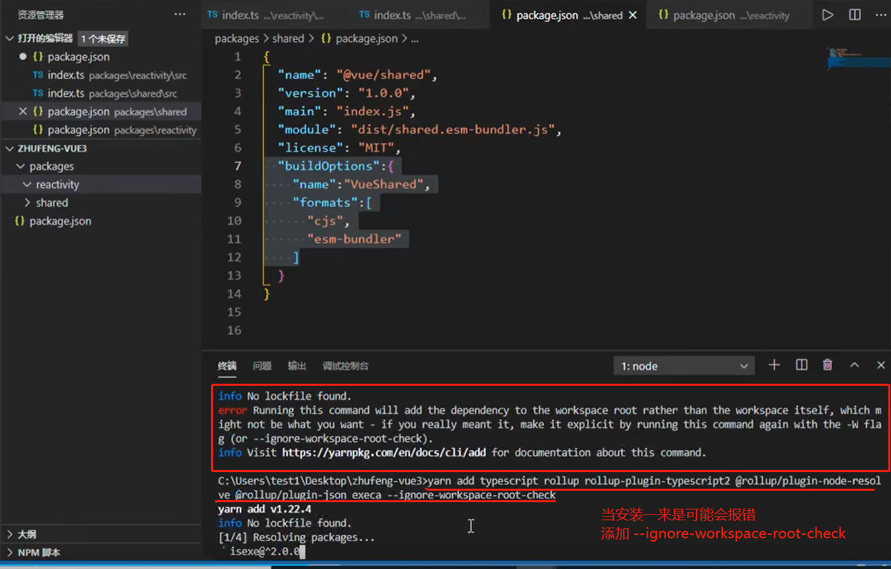
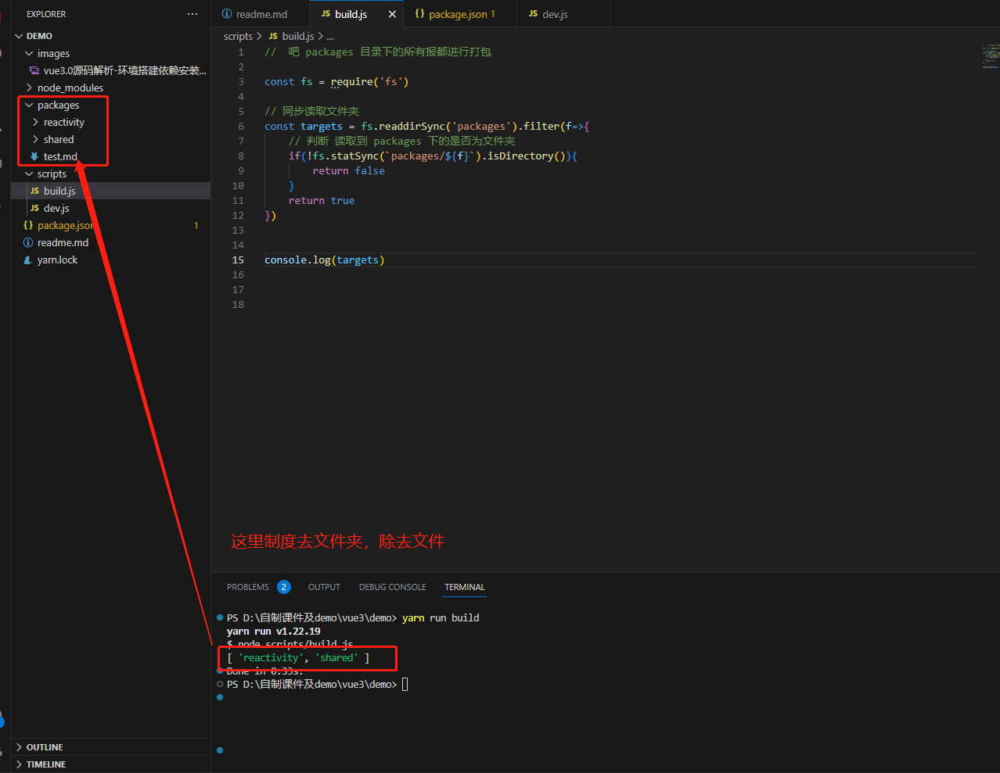

# vue3.0 源码解析

## 环境搭建
### 安装依赖(monorepo搭建)
  - yarn init -y 创建一个文件夹，执行 yarn init -y 初始化
  - 修改package.json 添加 provite:true (私有)， 添加工作看空间， workSpaces:["packages/*"]
  - 在packages目录下新建 reactivity、shared目录，同时分别执行 yarn init -y,并且在各自目录下，新建 src目录，且分别新建 index.ts
  - 初始化新建 对应对象，然后导出
  - 修改对应目录的package.json, `"name"："@vue/reactivity" ` 和 `"name":"@vue/shared"`
  - 在各个目录下修改package.json文件， 添加 `  "module": "dist/reactivity.esm-bundler.js",`,用于自适应webpack是引入的入口文件(es6)文件
  - ```json
    {
     "name": "@vue/reactivity",
     "version": "1.0.0",
     "main": "index.js",
     "module": "dist/reactivity.esm-bundler.js",
     "license": "MIT",
     "buildOptions":{
      "name":"VueReactivity",
      "formats":[
        "cjs",
        "esm-bundler",
        "global"
      ]
      }
    }
    ```
    这里三个入口文件，main:主要给我们的commonjs 使用， module:主要给我们的webpack工程化使用 formats:告诉打成那个类型包

  |    依赖     | 一个普通标题 | 
  | :------:   | :------: | 
  | typescript | 支持typescript | 
  | rollup-plugin-typecript2 |rollup和TS桥梁 |
  | rollup     | 大包工具 | 
  | @rollup/plugin-node-resolve | 解析node第三方模块 | 
  | @rollup/plugin-json | 支持引入json | 
  | execa | 开启子进程方便执行命令 | 

  - 
  `注意：安装依赖在最外层,根目录下安装，packages目录下是没有node_modules`

  ### 配置打包
  - 在根目录下新建 scripts目录
    - build.js
      - 在build是过滤出文件夹，防止出现文件，如：readme.md文件
      
      然后对模块依次并行打包
      - 在build下需要用 rollup进行打包，在根目录下创建rollup.config.js（这里在测试run build时出现插件不兼容，修改execa 为5.0版本,以上版本改为ESModule）
      - 配置rollup.config.js
      - 由于 vue3.0+ 使用ts, 执行 npx tsc --init 生成tsconfig.json文件,修改 target,module 为 EXNext
      - 注意： 这里的rollup版本为2.78.0，以上版本出现不兼容，无法进行打包
    - dev.js
      - dev配置基本和build一样，唯一区别是仅打包在开发的模块
      - 
         
         运 行 yarn install 会把包链接到node_modules下(默认创建软链)
         
         当我们引入模块化是会报错
         
        
         


  
